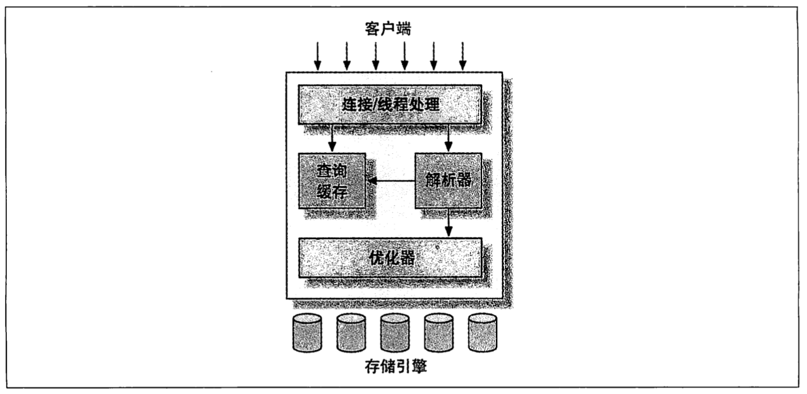
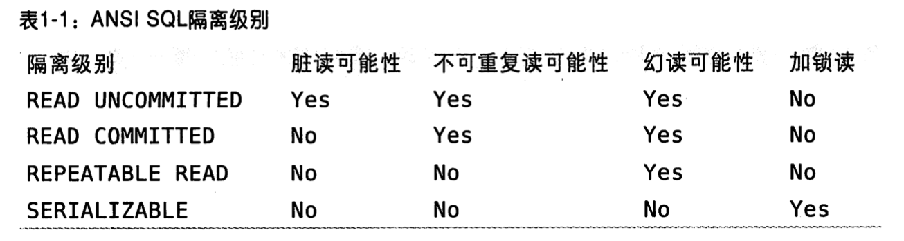

# Mysql的逻辑架构

3层结构：
1. 连接处理，授权认证，安全。
2. 核心服务功能，包括查询，分析，优化，缓存以及其他内置函数（例如时间，日期，数学函数等）。所有跨存储引擎的功能都在这一层实现。
3. 存储引擎，负责MySQL中数据的存储和提取。存储引擎不会去解析SQL（Innodb是个例外，它会解析外键定义，因为mysql服务器本身没有实现这个功能），不同的存储引擎之间也不会互相通信，只响应上层服务的请求。

## 连接管理与安全性
服务器缓存线程，减少频繁申请线程的开销。
 认证基于用户名，原始主机信息与密码，使用SSL连接还可以使用X.509证书认证。认证成功后会检测用户是否对库和表有操作权限。

## 执行与优化
MySQL会解析查询并创建内部数据结构（解析树），然后对其进行各种优化，包括重写查询，决定读表顺序，以及选择合适的索引。

优化并不关心表使用了什么存储引擎，但是存储引擎对优化查询是有影响的。优化器会让引擎提供容量或某个具体操作的开销信息，以及表数据的统计信息。

对于select解析查询之前，会先检查查询缓存，如果能在其中找到对应的查询，就不执行后续的操作，直接返回结果。

# 并发控制
只要多个查询同时修改数据，就会产生并发控制问题。MySQL在2个层面存在并发控制：服务器层和存储引擎层。

## 读写锁
解决这类问题的方法就是并发控制，其实非常简单。在处理并发读写时，可以实现由两种类型的锁组成的锁系统来解决问题。这个两个锁通常被称为共享锁和排他锁，也叫读锁和写锁。

读锁是共享的，或者说他互不阻塞，多个客户端可以同时读取通一个资源。写锁是排他的，也就是只有一个写锁会阻塞其他写锁的线程。只有这样才能保证同一时间内只有一个用户在执行写入，并防止其他用户读取正在写入的同一资源。

实际的数据库系统中，每时每刻都在发生锁定，当用户在修改某一部分数据时，MySQL会通过锁防止其他用户读取同一数据。大多数时候，MySQL锁的内部管理是透明的。

## 锁粒度
一种提高共享资源并发的方式是让锁定对象更具有选择性。尽量只锁定修改部分的数据，而不是所有资源。在给定的资源上，锁定的数据量越少，系统的并发程度越高，只要不相互冲突即可。

加锁也需要消耗资源，锁的各种操作，包括获得锁，检查锁和释放锁，都会增加系统开销，增加系统对锁的管理时间从而影响系统性能。

所谓锁策略就是在锁的开销和数据的安全性之间寻求平衡，这种平衡也会影响到性能。MySQL的每种存储引擎都可以实现自己的所策略和锁粒度。

### 表锁
表锁是MySQL中最基本的锁策略，并且是开销最小的策略。表锁会锁定整张表，一个用户对表进行操作之前首先要获取写锁，这回阻塞其他用户对该表的读写操作，只有没有写锁的情况下，其他用户才可以获取读锁，读锁之间互相不会阻塞。

### 行级锁
行锁可以最大程度的支持并发处理，行锁只在存储引擎层实现，服务层完全不了解存储引擎中的锁实现。

# 事务
事务是一组原子性的SQL查询，或者一个独立的工作单元。如果数据库引擎能成功的对数据库应用该组查询的全部语句，那么就执行查询如果其中一条语句崩溃或者无法执行，那么所有语句都不会执行。事务内的语句要么全成功，要么全失败。

1. 原子性：一个事务必须被视为一个不可分割的最小工作单元，整个事务要么全提交成功，要么全部失败回滚，对于一个事务来说，不可能只执行事务的一部分操作。
2. 一致性：数据库总是从一个一致性状态转移到另一个一致性状态。
3. 隔离性：一个事物在提交之前，通常对其他事务是不可见的。
4. 持久性：一旦事务提交，则其修改的部分就会永久保存在数据库中。即使系统崩溃，修改的数据也不会丢失（物理崩溃除外）。

与锁粒度一样，这种事务的处理过程中的额外的安全性，同样也会增加系统额外的开销。一个实现了ACID的数据库，通常会需要更强的CPU，更大的内存和更多的磁盘空间。这也正是MySQL的存储引擎可以发挥优势的地方。用户可以根据自己的需求来选择是否需要事务处理，来选择合适的存储引擎。

## 隔离级别
在标准SQL中定义了四种隔离级别，每种都规定了一个事务中所做的修改。
READ UNCOMMITED 未提交读
 在未提交读级别，事务中的修改，即使没有提交，也会对其他事务可见。事务可以读取未提交的数据，这也被称为脏读（Dirty Read）。

READ COMMITED 提交读
 多数系统默认的隔离级别是提交读。READ COMMITED的隔离定义：只要一个事务开始时，只能看见已经提交过的事务所做的修改。一个事务在提交修改之前所做的任何操作都是不可见的。这个级别也叫做不可重复读（nonrepeatable read）。因为执行两次同样的查询，可能会的到不一样的结果。

REPEATABLE READ 可重复读
 可重复读解决了脏读的问题，该级别保证了在同一个事物中多次读取同样记录的结果是一致的。但是理论上可重复读隔离级别还是无法解决幻读的问题。所谓幻读，是指当某个事物在读取某个范围内的记录时，另一个事务又在该范围内插入了新的数据，当前事务再次读取时会产生幻行。

SERIALIZABLE 可串行化
可串行化是最高隔离级别，通过强制串行化事务，避免幻读的问题。只有在非常确保数据一致性且可以接受没有并发的情况下，才考虑该级别。

## 死锁
死锁是指两个或者多个事务在同一资源上互相竞争，并请求锁定对方占用的资源。从而导致恶性循环。当多个事务以不同顺序锁定资源时，就会产生死锁。多个事务同时锁定同一个资源，也会产生死锁。

为了解决这个问题，数据库实现了各种死锁检测和死锁超时机制。一种解决方案是如果检测到死锁的循环依赖，并返回一个错误。另一种方法是当查询时间到达锁等待超时的设定后，放弃请求锁。InnoDB目前处理死锁的方式是将持有最少行级非排他锁的事务进行回滚。

锁的行为和顺序与存储引擎有关。以同样的顺序执行语句，有些引擎可能会产生死锁，有些则不会。死锁发生后只有完全或部分回滚一个事务，才能打破死锁。

## 事务日志
事务日志可以提高事务的效率。使用事务日志，存储引擎在修改表数据的时候只需要修改其内存拷贝，并将修改行为记录在持久在硬盘上的事务日志中。事务持久化之后，内存中被修改的数据在后台可以慢慢的写入到磁盘中。目前大多数存储引擎都是这样实现的，这种方式被称之为预写式日志（write-ahead log），修改数据需要些2次硬盘。

如果数据修改已经持久化到日志中，但是数据还没来得及写入到磁盘，系统崩溃，存储引擎在重启后能够自动恢复这部分数据。

